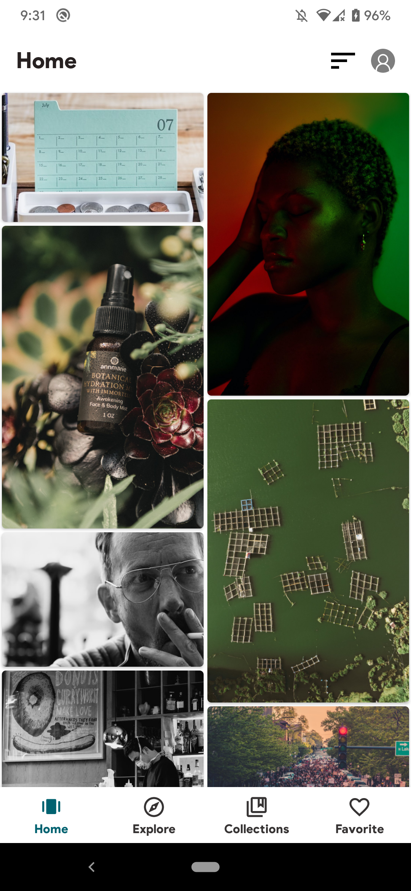
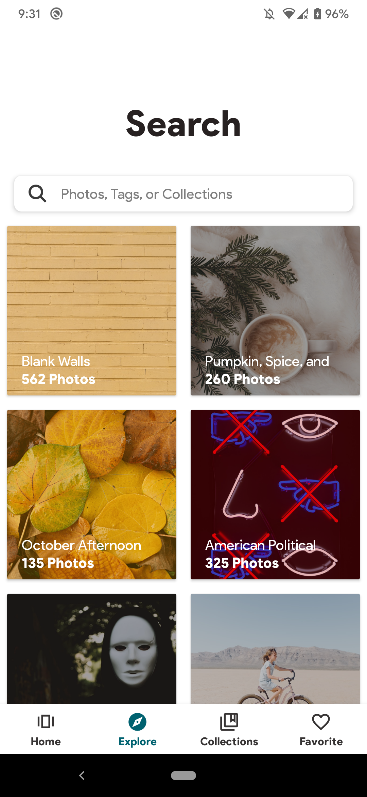
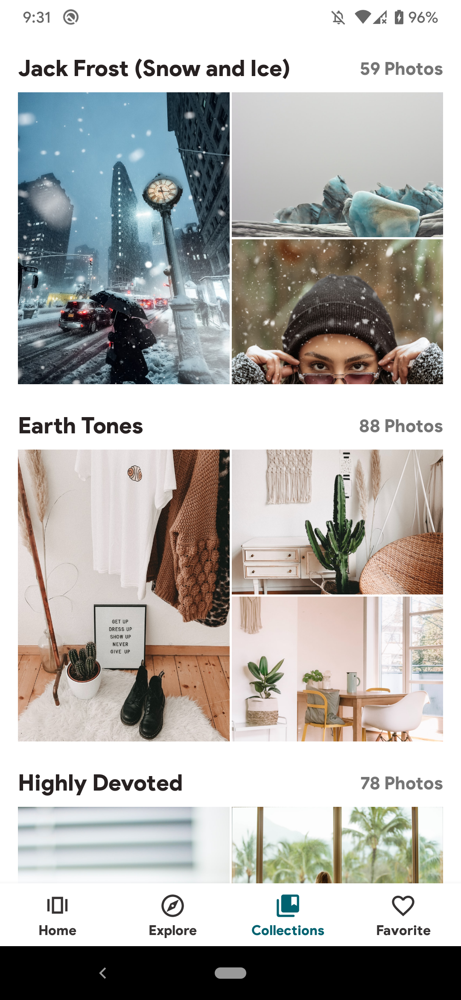
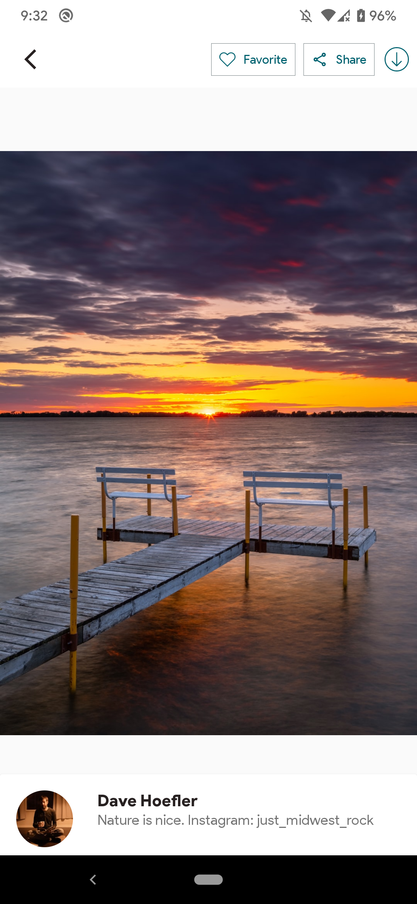

<h1 align="center">Louvre</h1>

  
Louvre is a small demo application based on modern Android application tech-stacks and MVVM architecture.
This project includes fetching data from the network and integrating caching data in the memory using dropbox store library.
First things first,I just checked out painting in tumblr and I found some of the museums amazing.Its name is Louvre.
So louvre came from museum

## Tech stacks and Third-party libraries
- [Kotlin](https://kotlinlang.org/) based project
- [Coroutine] (https://github.com/Kotlin/kotlinx.coroutines) for asynchronous
- [Dagger](https://github.com/google/dagger) for dependencies injection
- Architecture
    - Model + View + View Model
    - Data binding
- JetPack
    - LiveData - to obey observer pattern
    - View Model - to separate UI with Business logic
    - Room - for Persistence
- [Retrofit2](https://github.com/square/retrofit) - as HTTP client
- [Store](https://github.com/dropbox/Store) - for async data loading and caching
- [Timber and Stetho](https://github.com/JakeWharton/timber) for loggin and debugging
- [FragNav](https://github.com/ncapdevi/FragNav) for Fragment transaction
- [Adapter Delegate](https://github.com/sockeqwe/AdapterDelegates) for adapter delegation

## Download
Go to the [Releases](https://github.com/ThihaKaungSet3/Louvre/release/Louvre.apk) to download APK.

### Screenshots

  
  
  
  
  

    
